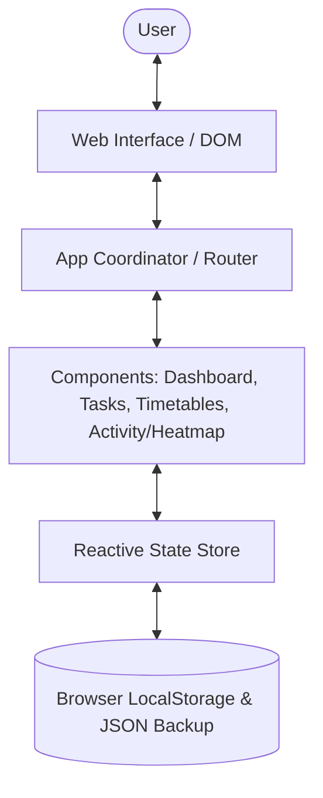

# Architecture Specification — Personal Tracker V1

## 1. System Overview

The **Personal Tracker** is designed as a fast, responsive, and resilient client-side web application. Built with **HTML5**, **Vanilla CSS**, and **Modern Modular JavaScript (ES Modules)**, it provides zero-dependency daily tracking with sub-millisecond local persistence.

---

## 2. Component Hierarchy

### Core Modules

* **`index.html`**: Semantic HTML5 shell providing the layout, top navigation bar, metric badges, universal modal container, and slide-over drawer.
* **`src/js/app.js`**: Application coordinator responsible for view switching, global action listeners, streak badge updating, and toast dispatching.
* **`src/js/state.js`**: Central reactive state store with event notification (`subscribe`), persistent `localStorage` synchronization, JSON export/import, and pre-packaged sample dataset seeding.
* **`src/js/utils/dateUtils.js`**: Date utilities for formatting, weekday mapping, streak computation, 52-week grid generation, and time conversions.
* **`src/js/icons.js`**: Crisp SVG icons for zero-dependency UI rendering.

### Views

1. **Dashboard (`src/js/components/dashboard.js`)**:
   * Displays high-level stats: Work Logged Today, Active Streak, Tasks Completed Today, and 7-day focus.
   * Renders today's combined schedule from both Academic and Career timetables.
   * Provides quick-toggle checkboxes for today's tasks and quick-action shortcuts.

2. **Daily Tasks (`src/js/components/tasksView.js`)**:
   * Supports task management for any selected date (today, yesterday, tomorrow, or custom date via datepicker).
   * Supports task attributes: title, category, date, priority, status (done/not done), planned duration, actual duration, and notes.
   * Includes one-click conversion of completed tasks into logged activities.

3. **Timetables (`src/js/components/timetableView.js`)**:
   * Logically separates **Academic Timetable** (college/academic schedule) and **Career Timetable** (DSA, ML, Projects, etc.).
   * Weekly 7-day columns (Monday through Sunday) with recurring slots.
   * Full slot CRUD operations with time sorting.

4. **Activity & Heatmap (`src/js/components/activityView.js`)**:
   * 52-week GitHub/LeetCode-style heatmap dynamically calculated from both recorded activities and completed daily tasks.
   * 5 intensity levels based on daily work minutes, with a guaranteed minimum active Level 1 on dates where at least one daily task is marked done.
   * Unified active-day and streak tracking that automatically deduplicates dates with both activities and completed tasks.
   * Interactive day inspection drawer showing all activities and tasks for any clicked date.
   * Comprehensive historical work log with category filtering and search.

---

## 3. Styling & Aesthetics

The application uses a custom-built **Vanilla CSS** design system:
* **Tokens**: Defined in `src/styles/main.css` (`--bg-primary: #090D16`, `--bg-surface: #1E293B`, `--accent-primary: #6366F1`, `--accent-emerald: #10B981`, `--accent-amber: #F59E0B`, etc.).
* **Glassmorphism**: Backdrop blur filters for the sticky header and modals.
* **Micro-animations**: Flame pulse animations, smooth button hover transitions, and slide-over drawers.
* **Responsiveness**: Flexible CSS grid and flexbox ensuring usability across desktop wide screens, tablets, and mobile devices.
